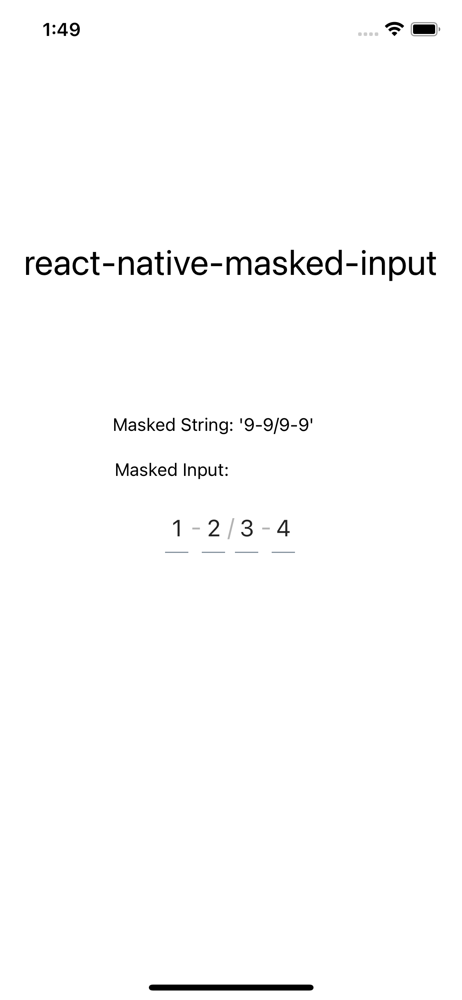

# react-native-masked-input

[](https://badge.fury.io/js/react-native-modal)
[](https://github.com/prettier/prettier)

A customizable react-native-masked-input.

The goal of `react-native-masked-input` is expanding the default react-native `TextInput` component by adding masked string and styles customization options.

<p align="center">

</p>

## Features

- Masked Input with different string combinations
- Customisable Style

## Setup

This library is available on npm, install it with: `npm i react-native-masked-input` or `yarn add react-native-masked-input`.

Install and setup the dependency `react-native-elements` by following <a href='https://reactnativeelements.com/docs/'>these instructions</a>.

## Usage

1.  Import react-native-masked-input:

```javascript
import MaskedInput from 'react-native-masked-input';
```

2.  Create a component and set mask as shown below:

```javascript
function WrapperComponent() {

  return (
    <View>
        <MaskedInput mask={'9-9/9-9'} />
    </View>
  );
}
```

3.  Then simply set the text by using the onChangeText prop:

```javascript
function WrapperComponent() {

  const [text, setText] = useState()

  return (
    <View>
        <MaskedInput onChangeText={setText} />
    </View>
  );
}
```

The `onChangeText` prop is the only prop you'll really need to make the masked input work: you should control this prop value by saving it in your wrapper component state and setting it.

## A complete example

The following example consists in a component (`MaskedInputExample`) with a masked input.
The masked input style is set by the `mask` prop and `onChangeText` prop can be used to set state variable.  

```javascript
import React, { useState } from 'react'
import { View } from 'react-native'
import MaskedInput from './MaskedInput'

export default function MaskedInputExample() {

    const [text, setText] = useState()

    return (
        <View style={{ flex: 1, justifyContent: 'center' }}>
            <MaskedInput
                mask='9-9/9-9'
                onChangeText={setText}
            />
        </View>
    )
}
```

For a more complex example take a look at the `/example` directory.

## Available props

| Name                           | Type             | Default                        | Description                                                                                                                                |
| ------------------------------ | ---------------- | ------------------------------ | ------------------------------------------------------------------------------------------------------------------------------------------ |
| mask                    | string |     '9-9-9-9'                |        String that is used to customise masked input.                                                                                                           |
| onChangeText                    | function |                     |        Callback that is called when the masked input's text changes.                                                                                                                |
| contentContainerStyle              | style           |                             | Style prop for `MaskedInput` Component Container.                                                                                                |
| containerStyle                   | style|                 | Style prop for `MaskedInput` Container.                                                                                                                       |
| inputContainerStyle             | style           |                              |     Style prop for `MaskedInput` Input Container.                                                                                           |
| activeInputStyle                  | style             |                           |   Style prop for `MaskedInput` active Input Container.                                                                                                     |
| inputStyle                    | style             |                            |  Style prop for `MaskedInput` Input.              |                                                                                                                 |
| textStyle                  | style           |                        | Style prop for `MaskedInput` Input's  Text.                                                                                                       |
| activeTextStyle                | style           |                            | Style prop for `MaskedInput` active Input's  Text.                                                                                              |
| seperatorTextStyle     | style           |                            |      Style prop for `MaskedInput` seperator's Text.                                                      |

## Pull requests, feedbacks and suggestions are welcome!